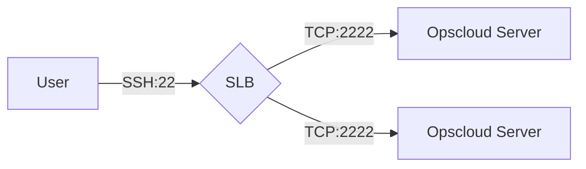

Welcome to the opscloud wiki!

# OpsCloud4.0 云上运维
</img>
</img> 
</img> 
</img>
 

</img>

#### 项目仓库
+ 服务端(Java)
  + [github.com/ixrjog/opscloud4](github.com/ixrjog/opscloud4)
+ 前端(Vue)
  + [github.com/ixrjog/opscloud4-web](github.com/ixrjog/opscloud4-web)

#### 开发环境
+ MacBook M1 PRO (macOS Monterey 12.3.1)
+ IntelliJ IDEA 2022.1 (Ultimate Edition)
+ WebStorm 2022.1

#### 主要功能
+ 动态数据源
  + Zabbix、Nacos、LDAP、Jenkins、Guacamole、Ansible、Nexus、Gitlab、Sonar、Dingtalk、TencentExmail
  + `Kubernetes`
    + ACK、EKS
  + `Aliyun`
    + ECS、Image、VPC、RAM[User、Policy]、RDS[Instance、Database、Redis]、DMS[User]、ONS[Instance、Topic、Group]、Log
  + `AWS`
    + EC2、IAM[User、Policy]、SQS[Queue]、SNS[Topic、Subscription]
+ 远程控制
  + 远程桌面[RDP、VNC]
    + apache-guacamole
  + WebTerminal
    + 支持多开、会话复制、命令同步、会话心跳
  + SSH-Server
    + 原生SSH协议实现，支持ED25519密钥
    + 简化用户登录，自动关联用户Gitlab账户公钥
    + 展示服务器环境，标签，授权账户
    + 支持Kubernetes容器登录或直接查看容器日志
    + 事件驱动技术
    + 部署架构

+ 服务器批量任务
  + Ansible Playbook
  + 单服务器多线程实现，任务日志更加清晰
+ RBAC,MFA(OTP)
+ 集群架构
  + 实例健康检查接口 /api/instance/health/lb-check (GET) 
  + 分布式调度任务(Quartz)、定时任务分布式锁(Shedlock)、任务并发锁(Redis)
  + 高性能、可伸缩、高可用性
    + 集群SLA99.99%
    + 无资产管理上限
+ 标签驱动、事件驱动 
+ API文档
  + example.com/doc.html
  + API Token

<table>
<tr>
<td></td>
<td></td>
</tr>
<tr>
<td></td>
<td></td>
</tr>
<tr>
<td></td>
<td></td>
</tr>
<tr>
<td></td>
<td></td>
</tr>
<tr>
<td></td>
<td></td>
</tr>
<tr>
<td></td>
<td></td>
</tr>
<tr>
<td></td>
<td></td>
</tr>
<tr>
<td></td>
<td></td>
</tr>
<tr>
<td></td>
<td></td>
</tr>
<tr>
<td></td>
<td></td>
</tr>

<tr>
<td></td>
<td></td>
</tr>

<tr>
<td></td>
<td></td>
</tr>

<tr>
<td></td>
<td></td>
</tr>

<tr>
<td></td>
</tr>
</table>

#### 平台演示视频1
<video src="https://opscloud-res.oss-cn-hangzhou.aliyuncs.com/opscloud4/video/opscloud4-1.mov" width="400px" height="300px" controls="controls"></video>

#### 帮助文档

<a style="color:#2b669a" href="https://www.kancloud.cn/ixrjog/opscloud4/2361886" target="_blank">传送门:https://www.kancloud.cn/ixrjog/opscloud4/2361886</a>

#### Thanks to JetBrains
<a href="https://www.jetbrains.com" target="_blank">
  </img>
</a>

> Thanks JetBrains to support the project providing such great IDE.