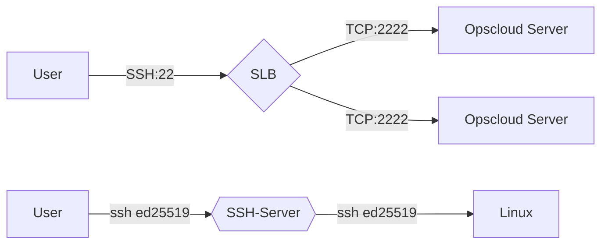

Welcome to the opscloud wiki!

## Thanks to JetBrains

> Thanks JetBrains to support the project providing such great IDE.

## OpsCloud4 云上运维
</img>
</img> 
</img> 
</img>
 

 

## 架构图

## Code repository
+ Backend
  + [https://github.com/ixrjog/opscloud4](https://github.com/ixrjog/opscloud4)
+ Frontend
  + [https://github.com/ixrjog/opscloud4-web](https://github.com/ixrjog/opscloud4-web)

## Database
+ [v4.6.0 opscloud4-github.sql](https://opscloud4-web.oss-eu-west-1.aliyuncs.com/package/4.6.0/opscloud4-github.sql)

## 登录信息
+ username:baiyi
+ password:空密码
  
## 开发环境
+ OpenJDK 21
+ node-v16.13.0
+ MacBook M1
+ IntelliJ IDEA 2023
+ WebStorm 2023

## Leo持续交付

+ 构建

</img>

+ 部署

</img>
</img>

+ 规则配置（封网）

</img>

+ 任务配置

</img>

## 容器堡垒机（集成:Leo持续交付版本信息,多可用区部署可视化）
</img>

## 主要功能
+ Leo持续交付（Kubernetes）
  + 全冗余架构，多Jenkins引擎且无状态
  + 权限控制/封网策略
  + 分组（蓝/绿），金丝雀部署；可视化发布过程
+ 多实例动态数据源，万物皆资产
+ 堡垒机
  + 服务器Web终端
    + 多服务器同时连接+命令同步、会话复制、会话心跳
    + 支持ED25519、RSA密钥
  + KubernetesWeb终端
    + 多容器同时登录+命令同步、容器日志、会话心跳 
  + SSH-Server
    + 原生SSH协议实现，支持ED25519密钥
    + 简化用户登录，自动关联用户GitLab账户公钥
    + 支持服务器、容器登录

+ 服务器批量任务
  + Ansible Playbook
  + 单服务器多线程实现，任务日志更加清晰
+ RBAC,MFA(OTP)
+ 集群架构
  + 实例健康检查接口 /api/instance/health/lb-check (GET) 
  + 分布式调度任务(Quartz)、定时任务分布式锁(Shedlock)、任务并发锁(Redis)
  + 高性能、可伸缩、高可用性
+ 标签驱动、事件驱动 
+ API文档
  + example.com/doc.html
  + API Token

## Services & Ports

| service    | protocol | port | startup parameter     |
|------------|----------|------|-----------------------|
| web        | http     | 8080 | --server.port=8080    |
| ssh-server | ssh      | 2222 | --ssh.shell.port=2222 |

## 功能截图

<table>
<tr>
<td></td>
<td></td>
</tr>
<tr>
<td></td>
<td></td>
</tr>
<tr>
<td></td>
<td></td>
</tr>
<tr>
<td></td>
<td></td>
</tr>
<tr>
<td></td>
<td></td>
</tr>
<tr>
<td></td>
<td></td>
</tr>
<tr>
<td></td>
<td></td>
</tr>
<tr>
<td></td>
<td></td>
</tr>
<tr>
<td></td>
<td></td>
</tr>
<tr>
<td></td>
<td></td>
</tr>

<tr>
<td></td>
<td></td>
</tr>

<tr>
<td></td>
<td></td>
</tr>

<tr>
<td></td>
<td></td>
</tr>

<tr>
<td></td>
</tr>
</table>

## 平台演示视频1
<video src="https://opscloud-res.oss-cn-hangzhou.aliyuncs.com/opscloud4/video/opscloud4-1.mov" width="400px" height="300px" controls="controls"></video>

## 帮助文档

<a style="color:#2b669a" href="https://www.kancloud.cn/ixrjog/opscloud4/2361886" target="_blank">传送门:https://www.kancloud.cn/ixrjog/opscloud4/2361886</a>

## 交流群
Q群: 630913972
